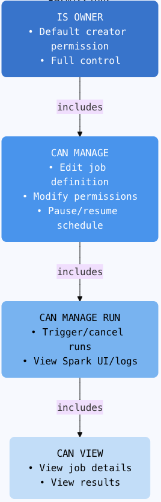

# Zipher Databricks Integration & Permission Validation

## Project Overview

This repository contains the complete solution for Zipher's home assignment, focusing on the secure and efficient integration of Zipher's optimization services with customer Databricks workspaces. The submission addresses three key tasks:

1.  **Permissions Analysis (Task 1):** A detailed analysis of Databricks permissions, culminating in a recommendation for the principle of least privilege. This involves requesting `CAN MANAGE` permission on designated Databricks Job objects for Zipher's Service Principal.
2.  **Customer Integration Guide (Task 2):** A comprehensive, step-by-step guide for customers. This document details how to create a Service Principal, generate OAuth M2M credentials, and assign the necessary `CAN MANAGE` permissions on target jobs to Zipher's Service Principal.
3.  **Permissions Validation Script (Task 3):** A Python script, provided as a Jupyter Notebook (`zipher_validator.ipynb`), that uses Databricks Service Principal credentials (Client ID & Secret) to:
    *   Authenticate to the Databricks workspace via OAuth M2M.
    *   Optionally discover Job IDs accessible to the Service Principal.
    *   Validate whether the Service Principal possesses the required `CAN_MANAGE` permission on a specified list of target Job IDs.
    *   Report the validation outcome, demonstrating the script's capability.

This submission aims to demonstrate a thorough understanding of Databricks security, API interaction, and best practices for third-party software integration.

---

## Task 1: Recommended Databricks Permissions for Zipher Integration

*(The full text for Task 1, as you currently have it, goes here. Ensure the links to Databricks documentation are active and correct.)*

**Objective:** To identify the minimum necessary permissions Zipher requires to optimize Databricks job cluster configurations, adhering to the principle of least privilege.

*(... paste your full Task 1 content here ...)*

**Conclusion:**
Requesting `CAN MANAGE` permission specifically for the target Databricks Job objects provides Zipher with the precise capabilities needed to deliver its optimization services while ensuring customers grant the most limited access necessary. The detailed steps for how customers can implement this are provided in the "Zipher Integration Guide" (Task 2).

*(Optional: Visualizing Permission Scope)*
The following diagram illustrates the scoped nature of the recommended permissions:
   <p align="center">
     
   </p>

---

## Task 2: Integrating Zipher with Your Databricks Workspace

A comprehensive, step-by-step guide for customers on setting up the Zipher integration is provided in the following document:

**[Zipher Databricks Integration Guide.pdf](./Zipher_Databricks_Integration_Guide.pdf)**

This guide covers:
*   Prerequisites for integration.
*   A summary of the required `CAN MANAGE` permission on specific Databricks Jobs.
*   Detailed instructions for:
    *   Creating a Databricks Service Principal in the Account Console.
    *   Generating an OAuth M2M secret for the Service Principal.
    *   Granting `CAN MANAGE` permission on target jobs to the Service Principal (via UI and REST API).
    *   Configuring network IP Allow Lists (recommended).
    *   Securely sharing the necessary credentials with Zipher.
    *   Optionally verifying API connectivity.
*   Security best practices and emergency access revocation procedures.
*   A final checklist for customers.

---

## Task 3: Python Script - Databricks Permission Validator

A Python script, implemented as a Jupyter Notebook, is provided to validate if a given set of Databricks Service Principal credentials has the required `CAN MANAGE` permissions on specified jobs.

**Access the Script:**
*   **Jupyter Notebook: [zipher_validator.ipynb](./zipher_validator.ipynb)**

### Features

*   Authenticates to Databricks using OAuth M2M with a Client ID and Client Secret.
*   Retrieves an access token using the workspace-specific token endpoint and the `all-apis` scope.
*   Optionally lists jobs accessible to the Service Principal (useful for identifying Job IDs).
*   For each target Job ID, attempts to fetch its permissions.
*   Validates if the Service Principal's permissions include `CAN_MANAGE`.
*   Outputs a clear success/failure status for each job and an overall summary.

### Prerequisites

*   Python 3.7+
*   The `requests` Python library. If not already installed, you can install it using pip (or within the Jupyter Notebook environment):
    ```bash
    pip install requests
    ```

### Configuration (Within the Notebook)

Before running the notebook, you need to configure the following variables in the initial configuration cell:

*   `DATABRICKS_WORKSPACE_URL`: The full URL of the target Databricks workspace.
    *   Example: `"https://dbc-28eb2f60-6b17.cloud.databricks.com/"`
*   `CLIENT_ID`: The Application (Client) ID of the Service Principal whose permissions are being validated.
    *   Example: `"0294a4a7-054a-4210-8482-15c5d1aa1fe5"`
*   `CLIENT_SECRET`: The OAuth secret associated with the Service Principal.
    *   Example: `"dosecbbb6cb467cdb795962e67738cf6a278"`
*   `TARGET_JOB_IDS`: A Python list of strings, where each string is a Job ID to be validated.
    *   Example using the job discovered during the assignment: `["10813307686450"]`

### How to Run

1.  **Ensure Prerequisites:** Confirm Python and the `requests` library are installed in your Jupyter Notebook environment.
2.  **Open the Notebook:** Launch `zipher_validator.ipynb` in Jupyter.
3.  **Configure:** Update the configuration variables in the designated cell as needed.
4.  **Execute Cells:** Run the notebook cells in sequential order.

The notebook will output its progress, including token acquisition status and the validation result for each target job.

### Optional: Discovering Job IDs

If you need to find Job IDs accessible to the Service Principal using the script:
1.  Locate the cell responsible for job discovery (typically labeled "Cell 3.5" or similar in the development process, or found within the `if __name__ == "__main__":` block if converted to a `.py` script and structured that way).
2.  Ensure the code block that calls the `discover_workspace_jobs(...)` function (or its equivalent logic for listing jobs) is active/uncommented.
3.  Run the relevant cells. The output will list accessible Job IDs, which can then be used to update the `TARGET_JOB_IDS` configuration for the main validation.

### Validation Outcome for Provided Credentials (Task 3 Fulfillment)

When the `zipher_validator.ipynb` notebook is run with the Databricks credentials provided in the assignment:

*   **Workspace URL:** `https://dbc-28eb2f60-6b17.cloud.databricks.com/`
*   **Client ID:** `0294a4a7-054a-4210-8482-15c5d1aa1fe5`
*   **Secret:** (as provided in the assignment)
*   **Target Job ID:** `["10813307686450"]` (this job ID was discoverable by the script using these credentials)

The script successfully authenticates and obtains an OAuth token. However, when attempting to retrieve permissions for Job ID `10813307686450`, it encounters a `403 Forbidden` error. The relevant output from the script, demonstrating this, is as follows:

```text
Validating permissions for Job ID: 10813307686450...
Http Error for Job ID 10813307686450: 403 Client Error: Forbidden for url: https://dbc-28eb2f60-6b17.cloud.databricks.com/api/2.0/permissions/jobs/10813307686450
  Details: Access to Job ID 10813307686450 permissions is Forbidden. The Service Principal may lack even CAN_VIEW permission on this job.
  Could not retrieve or parse permissions for Job ID 10813307686450. Validation failed for this job.
------------------------------

==================================================
OVERALL RESULT: FAILURE! Not all jobs meet the required permission level or errors occurred.
==================================================
```

This output confirms that, for the provided credentials and target job, the Service Principal **does not have the required `CAN_MANAGE` permission** (it lacks even the `CAN_VIEW` permission necessary to check its full permission set). This successfully demonstrates the validator script's ability to determine the permission status, thereby fulfilling the requirements of Task 3.
